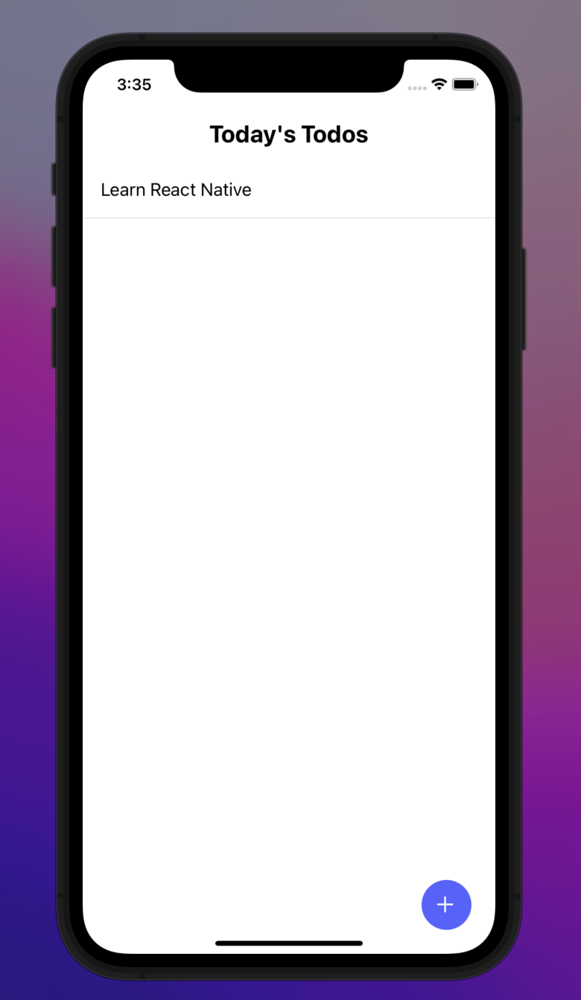
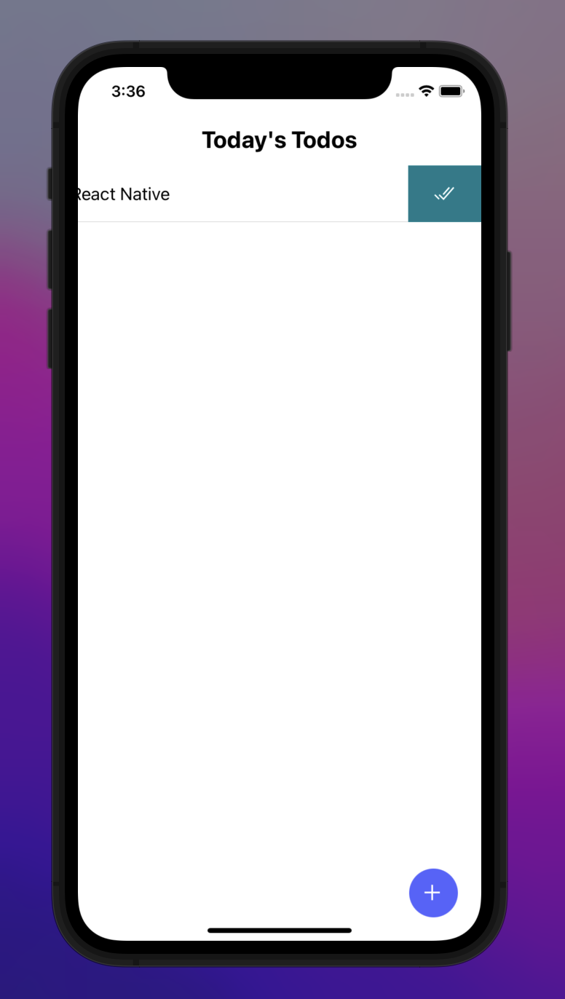
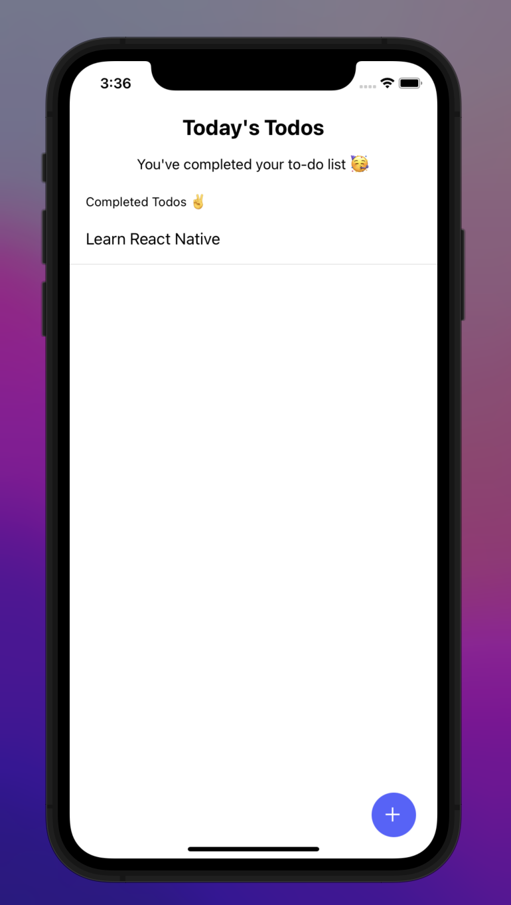
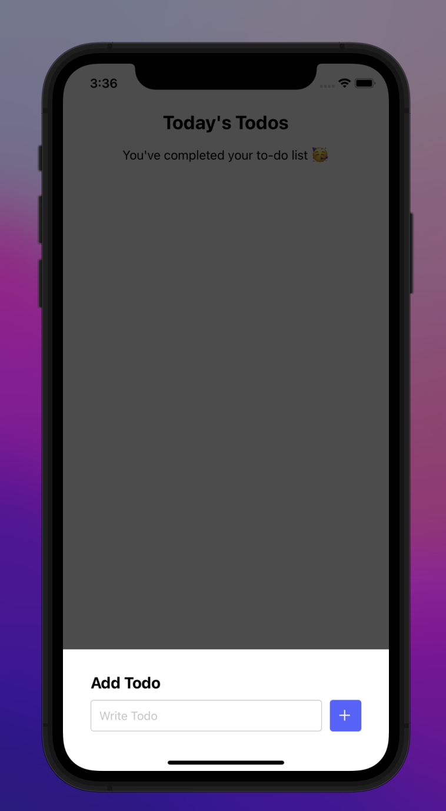

# Todo App

## Todo app developed using [React Native(Expo)](https://expo.dev/)

## Getting Started

Install dependencies:

```bash
npm install
# or
yarn
```

First, run the development server:

```bash
npm run start
# or
yarn start
```

Then run the project on ios, android or web

- For the IOS Emulator

```bash
npm run ios
# or
yarn ios
```

- For the Android Emulator

```bash
npm run android
# or
yarn android
```

- For the Web

```bash
npm run web
# or
yarn web
```

<table>
  <tr>
    <td>
      
    </td>
    <td>
      
    </td>
    <td>
      
    </td>
  </tr>
  <tr>
  <td>
      
  </td>
  <td>
      
  </td>
  </tr>
</table>
